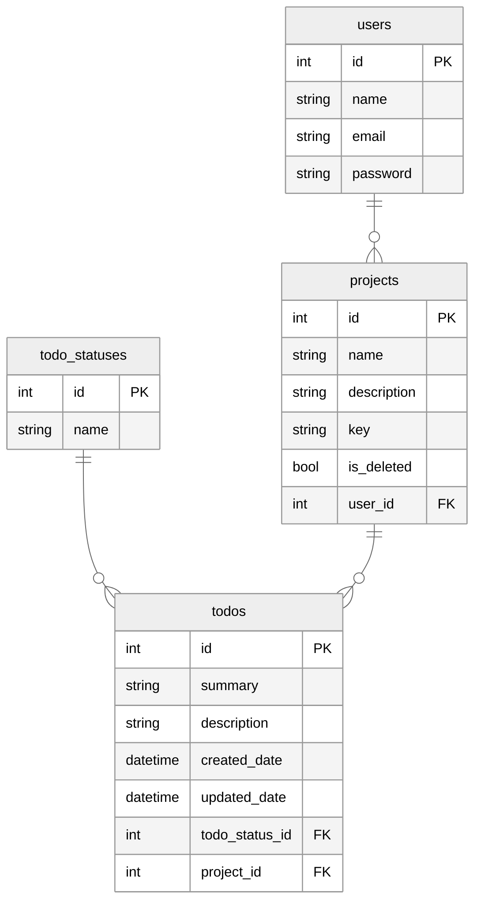

# Todo Web Application

A website to store and manage todo items. It permits:

- Adding and managing todo items
- Adding and managing projects to contain todo items.
- User Administration

# Database and Persistance

## We use the following technologies:

- Postgres
  - Postgres is the provider we have selected for this project. Postgres is a powerful, open source relational database and is known for reliability, integrity and performance.
- Flyway
  - Flyway is a tool that progress database migrations scripts and executes them to get a database into a specific state. It tracks what has been executed in a table called `flyway_schema_history`. For more information on the required naming conventions see [here](https://www.red-gate.com/blog/database-devops/flyway-naming-patterns-matter).
  - With flyway it is possible to move the database into a later version with `V` prefixed scripts, a previous version with `U` prefixed scripts and apply repeatable migrations by using the `R` prefix.

## Entity Relationship Diagram (ERD):

