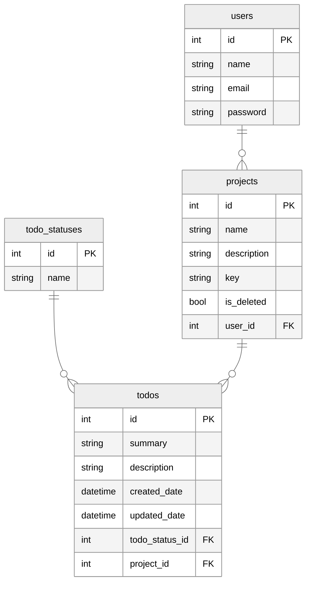

# Todo Web Application

A website to store and manage todo items. It permits:

- Adding and managing todo items
- Adding and managing projects to contain todo items.
- User Login
- User Registration
- User Administration

# Database and Persistance

## Overview of technologies:

- Postgres
  - Postgres is the provider we have selected for this project. Postgres is a powerful, open source relational database and is known for reliability, integrity and performance.
- Flyway
  - Flyway is a tool that progress database migrations scripts and executes them to get a database into a specific state. It tracks what has been executed in a table called `flyway_schema_history`. For more information on the required naming conventions see [here](https://www.red-gate.com/blog/database-devops/flyway-naming-patterns-matter).
  - With flyway it is possible to move the database into a later version with `V` prefixed scripts, a previous version with `U` prefixed scripts and apply repeatable migrations by using the `R` prefix.

## Entity Relationship Diagram (ERD):

Diagram created using [mermaid] (https://mermaid-js.github.io/mermaid/#/)



# API

With the APIs we are trying to follow established RESTFUL conventions as much as possible, you can find a great guide [here](https://docs.microsoft.com/en-us/azure/architecture/best-practices/api-design)

## Overview of technologies:

- NPM
  - NPM is a package manager for Javascript that allows us to import packages from the npm package registry. There are many options available for this tool, but for our sessions we will mostly use `npm start` and `npm install`.
- Express
  - Express is what we use to provide the web framework & routing for our application. It gives us the ability to accept http requests and respond appropriately.
- Nodemon
  - Nodemon is a tool that simply monitors your directory with your running application and will `live re-load` if a file change occurs.
- Swagger
  - Swagger is configured for the tool and can be accessed [here](http://localhost:3000/api-docs) we can also access the open api specification itself by accessing [here](http://localhost:3000/swagger.json).

## Running locally:

To run the API locally you simply need to:

1. navigate with your terminal into `./server`
2. (optional and only if changed) run `npm i` or `npm install`
3. run `npm start`

After this you can start hitting the endpoints below using the URI and method/verb.

## Setting up node locally:

I recommend using [NVM](https://github.com/nvm-sh/nvm) or a similar node version manager, installation instructions can be found on the github repository.

Once NVM is installed the following commands are available:

- `nvm install x.x.x` – Installs a specific version of node
- `nvm use x.x.x` – switch to a specific version of node
- `nvm ls` – what versions of node we have installed, what version we’re using and some of the main LTS releases available

For the purposes of this project, our node requirement isn't a very high version, but using the latest will probably be ok.

## API Documentation

To facilitate the generation of our open API specification and swagger we use two packages:

- [swagger-jsdoc](https://github.com/Surnet/swagger-jsdoc)
- [swagger-ui-express](https://github.com/scottie1984/swagger-ui-express)

The configuration is pretty straightforward. We simply add this to our index.js

```
const swaggerJsdoc = require("swagger-jsdoc");
const swaggerUI = require("swagger-ui-express");

...

const swaggerDefinition = {
  openapi: "3.0.0",
  info: {
    title: "Todos API",
    version: "1.0.0",
  },
  servers: [
    {
      url: "http://localhost:3000",
      description: "Local development server",
    },
  ],
};

const openapiSpecification = swaggerJsdoc({
  swaggerDefinition,
  apis: ["./routers/*.js"],
});

...

app.use("/docs", swaggerUI.serve, swaggerUI.setup(openapiSpecification));
app.use("/api-docs", (req, res) => res.json(openapiSpecification).status(200));
```

and for each of our router endpoints, we add simple JS docs above with the required OpenAPI Spec:

```
/**
 * @swagger
 * /projects:
 *   get:
 *     tags: [
 *       projects
 *     ]
 *     summary: Returns an array of projects items with the name and key
 *     responses:
 *       200:
 *         description: OK
 *         content:
 *           application/json:
 *             examples:
 *               jsonObject:
 *                 summary: An example JSON response
 *                 value: '[{ "id": 1, "name": "Some Items", "key": "SI" }, { "id": 2, "summary": "More Items", "key": "MI" }]'
 *       204:
 *         description: No content
 */
router.route("/")
.get((req, res) => {
  ...
```

## Endpoints:

### Projects

```
GET - /projects/ - GETS ALL PROJECTS - May also have query arguments = /projects?name=test&updateDate=01/01/2022

GET - /projects/{projectId} - GETS A SINGLE PROJECT - typically also includes more information

POST - /projects/ - CREATES A NEW PROJECT - HTTP BODY - used to create the new record - mime type application/json

PUT - /projects/{projectId} - REPLACES/UPDATES A PROJECT - path argument to identify - HTTP BODY - used to update the record - mime type application/json

DELETE - /projects/{projectId} - DELETES A PROJECT - path argument to identify
```

### Todos

```
GET - /projects/{projectId}/todos - GETS ALL TODOS - May also have query arguments = /projects/{projectId}/todos?name=test

GET - /projects/{projectId}/todos/{todoId} - GETS A SINGLE TODO - typically also includes more information

POST - /projects/{projectId}/todos/ - CREATES A NEW TODO - HTTP BODY - used to create the new record - mime type application/json

PUT - /projects/{projectId}/todos/{todoId} - REPLACES/UPDATES A PROJECT - path argument to identify - HTTP BODY - used to update the record - mime type application/json

DELETE - /projects/{projectId}/todos/{todoId} - DELETES A TODO - path argument to identify
```

### TodoStatuses

```
GET - /todos/statuses
```

### Users

```
GET - /users/ - GETS ALL USERS - May also have query arguments = /users?name=test

GET - /users/{userId} - GETS A SINGLE USER - typically also includes more information

POST - /users/ - CREATES A NEW USER - HTTP BODY - used to create the new record - mime type application/json

PUT - /users/{userId} - REPLACES/UPDATES A USER - path argument to identify - HTTP BODY - used to update the record - mime type application/json

DELETE - /users/{userId} - DELETES A USER - path argument to identify
```

## Validation

For validation with the API we use [express-validator](https://express-validator.github.io/docs/), this provides a simple to use syntax to add in a number of prebuilt or custom checks for request data. To add validation we simply add an two arguments to our individual routes:

```
router
  .route("/")
  .post(
    [
      body("name")
        .isString()
        .withMessage("the name must have minimum length of 3")
        .trim(),
    ],
    validationUtils.validate,
    (req, res) => {
      ...
```

Firstly we add an array of the validation we want, these will typically be:

- check - will verify all mechanisms for the field specified.
- param - will verify path arguments for the field specified.
- body - will verify request body for the field specified.

Additional details can be found [here](https://express-validator.github.io/docs/check-api.html)

We then set how we want to handle if there are errors. In the above example I use `validationUtils.validate`, which looks like:

```
const { validationResult } = require("express-validator");

function validate(req, res, next) {
  const error = validationResult(req);
  const hasError = !error.isEmpty();

  if (hasError) {
    res.status(400).json({ error: error.array() });
  } else {
    next();
  }
}

const validationUtils = { validate };
module.exports = validationUtils;
```

## Prisma

We use a technology called [Prisma](https://github.com/prisma/prisma), this allows us to scan our database, create models that represent the tables and using these models perform CRUD operations on our database.

As we previously created configured database with Flyway, we don't need to use Prisma to carry out any migrations(which it does support), instead we want to use it with the existing database pathway. The details on configuring that can be found [here](https://www.prisma.io/docs/getting-started/setup-prisma/add-to-existing-project/relational-databases-typescript-postgres)

In terms of usage of prisma, it's relatively straightforward for most operations (but can get a little complicated as the query complexity increases). Some examples can be found below:

### Query a table

```
  const projects = await prisma.projects.findMany({});
```

### Find a single record

```
  const project = await prisma.projects.findUnique({
    where: {
      id: parseInt(projectId),
    },
  });
```

### Create a record

```
  await prisma.projects.create({
    data: {
      name: name,
      description: description,
      key: key,
    },
  });
```

### Update a record

```
  await prisma.projects.update({
    where: {
      id: parseInt(projectId),
    }
    data: {
      name: name,
      description: description,
      key: key,
    },
  });
```

### Delete a record

```
  await prisma.projects.delete({
    where: {
      id: parseInt(projectId),
    },
  });
```

### Architecture

In terms of the architectural patterns we're applying on the API. We are making use of _Model-View-Controller_ (MVC). MVC helps us to implement separation of concerns as we designate responsibilities for certain parts of our application.

MVC allows us to move away from potentially having larger files and help to keep our application more organised

Additional we're also using the _Layered Architecture_ - More details to follow.
