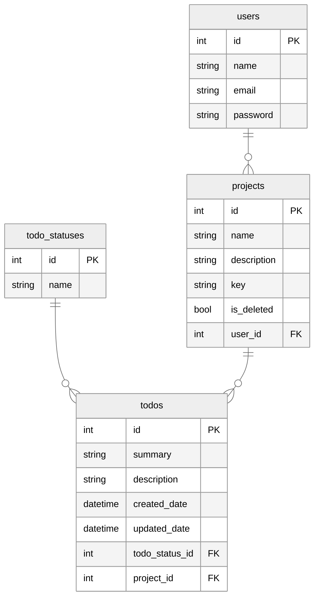

# Todo Web Application

A website to store and manage todo items. It permits:

- Adding and managing todo items
- Adding and managing projects to contain todo items.
- User Administration

# Database and Persistance

## Overview of technologies:

- Postgres
  - Postgres is the provider we have selected for this project. Postgres is a powerful, open source relational database and is known for reliability, integrity and performance.
- Flyway
  - Flyway is a tool that progress database migrations scripts and executes them to get a database into a specific state. It tracks what has been executed in a table called `flyway_schema_history`. For more information on the required naming conventions see [here](https://www.red-gate.com/blog/database-devops/flyway-naming-patterns-matter).
  - With flyway it is possible to move the database into a later version with `V` prefixed scripts, a previous version with `U` prefixed scripts and apply repeatable migrations by using the `R` prefix.

## Entity Relationship Diagram (ERD):

Diagram created using [mermaid] (https://mermaid-js.github.io/mermaid/#/)



# API

With the APIs we are trying to follow established RESTFUL conventions as much as possible, you can find a great guide [here](https://docs.microsoft.com/en-us/azure/architecture/best-practices/api-design)

## Overview of technologies:

- NPM
  - NPM is a package manager for Javascript that allows us to import packages from the npm package registry. There are many options available for this tool, but for our sessions we will mostly use `npm start` and `npm install`.
- Express
  - Express is what we use to provide the web framework & routing for our application. It gives us the ability to accept http requests and respond appropriately.
- Nodemon
  - Nodemon is a tool that simply monitors your directory with your running application and will `live re-load` if a file change occurs.

## Running locally:

To run the API locally you simply need to:

1. navigate with your terminal into `./server`
2. (optional and only if changed) run `npm i` or `npm install`
3. run `npm start`

After this you can start hitting the endpoints below using the URI and method/verb.

## Setting up node locally:

I recommend using [NVM](https://github.com/nvm-sh/nvm) or a similar node version manager, installation instructions can be found on the github repository.

Once NVM is installed the following commands are available:

- `nvm install x.x.x` – Installs a specific version of node
- `nvm use x.x.x` – switch to a specific version of node
- `nvm ls` – what versions of node we have installed, what version we’re using and some of the main LTS releases available

For the purposes of this project, our node requirement isn't a very high version, but using the latest will probably be ok.

## Endpoints:

### Projects

```
GET - /projects/ - GETS ALL PROJECTS - May also have query arguments = /projects?name=test&updateDate=01/01/2022

GET - /projects/{projectId} - GETS A SINGLE PROJECT - typically also includes more information

POST - /projects/ - CREATES A NEW PROJECT - HTTP BODY - used to create the new record - mime type application/json

PUT - /projects/{projectId} - REPLACES/UPDATES A PROJECT - path argument to identify - HTTP BODY - used to update the record - mime type application/json

DELETE - /projects/{projectId} - DELETES A PROJECT - path argument to identify
```

### Todos

```
GET - /projects/{projectId}/todos - GETS ALL TODOS - May also have query arguments = /projects/{projectId}/todos?name=test

GET - /projects/{projectId}/todos/{todoId} - GETS A SINGLE TODO - typically also includes more information

POST - /projects/{projectId}/todos/ - CREATES A NEW TODO - HTTP BODY - used to create the new record - mime type application/json

PUT - /projects/{projectId}/todos/{todoId} - REPLACES/UPDATES A PROJECT - path argument to identify - HTTP BODY - used to update the record - mime type application/json

DELETE - /projects/{projectId}/todos/{todoId} - DELETES A TODO - path argument to identify
```

### TodoStatuses

```
GET - /todos/statuses
```

### Users

```
GET - /users/ - GETS ALL USERS - May also have query arguments = /users?name=test

GET - /users/{userId} - GETS A SINGLE USER - typically also includes more information

POST - /users/ - CREATES A NEW USER - HTTP BODY - used to create the new record - mime type application/json

PUT - /users/{userId} - REPLACES/UPDATES A USER - path argument to identify - HTTP BODY - used to update the record - mime type application/json

DELETE - /users/{userId} - DELETES A USER - path argument to identify
```
